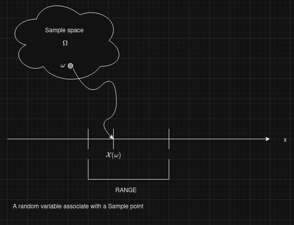
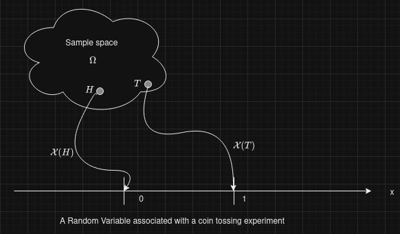
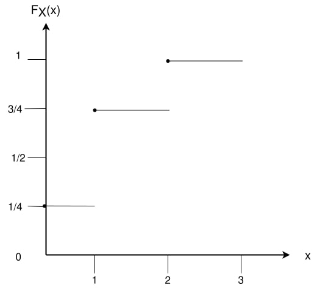
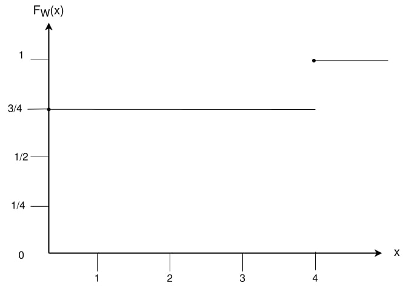

# Random Variables
Quantities governed by randomness correspond to functions on the probability space called *Random variables*. The values taken by a random variable is subject to chance, and the associated likelihoods are described by a function called the distributed function.

### Definition 1 _(Random variable)_ :
A random variable is a function $\mathcal(X) : \Omega \to \mathbb{R}$ with the property that $\{ \omega \in \Omega : \mathcal(X) \leq x \} \in \mathcal{F} $ for each $x \in \mathbb{R}$. such a function is said to be   $\mathcal(F)$-measurable. Random variables map $\Omega$ into $\mathbb{R}$.

**_Example 1_**
A fair coin is tossed twice. The sample space can be written as $\Omega = \{HH, HT, TH, TT\}$. For $\omega \in \Omega$, let $\mathcal{X}(\omega)$ be the number of heads seen after the coin has been tossed twice, so $\mathcal{X}(HH) = 2, \mathcal{X}(HT) = \mathcal{X}(TH) = 1, \mathcal{X}(TT) = 0 $.

**_Example 2_**
Let $\mathcal{W}$ be a random variable based on the experiment where a person $A$ is gambling $B$ rs amount on the result of the experiment. He gambles cumalatively so that his fortunes double everytime a head appears and is annhilated when a tail appears, so $\mathcal{W}(HH) = 4B, \mathcal{W}(HT) = \mathcal{W}(TH) = \mathcal{W}(TT) = 0 $.

After the experiment is done and the outcome $\omega \in \Omega$ is known, a random variable $\mathcal{X} : \Omega \to \mathbb{R}$ takes some value.

### Definition 2 _(Probability distributive function)_ :
The distributive function of a random variable $\mathcal{X}$ is the function $F : \mathbb{R} \to [0, 1] $ given by $F(x) = \mathbb{P}(\mathcal{X} \leq x)$

- For the above Example
$$\begin{equation}
  F_{\mathcal{X}}(x) =
    \begin{cases}
      0 & \text{$x < 0$}\\
      \frac{1}{4} & \text{$0 \leq x < 1$}\\
      \frac{3}{4} & \text{$ 1 \leq x < 2$}\\
      1 & \text{$x \geq 2$} 
    \end{cases}       
\end{equation} $$

$$\begin{equation}
  F_{\mathcal{W}}(\omega) =
    \begin{cases}
      0 & \text{$\omega < 0$}\\
      \frac{3}{4} & \text{$ 0 \leq \omega < 4$}\\
      1 & \text{$\omega \geq 4$} 
    \end{cases}       
\end{equation} $$

The distribution $F$ has the following properties
- $\lim_{x \to - \infty} F(x) = 0 $, $\lim_{x \to \infty} F(x) = 1$

- if $x < y$. then $F(x) \leq F(y)$

- $F$ is a right continous, that is $F(x + h) \to F(x)$ as $h \to 0$

$F$ is the distribution function of some random variables if and only if it satisfies the above 3 properties.

Suppose $F$ is a distributive function of $\mathcal{X}$. Then 
- $\mathbb{P}(\mathcal{X} > x) = 1 - F(x)$

- $\mathbb{P}(x < \mathcal{X} \leq y) = F(y) -F(x)$

- $\mathbb{P}(\mathcal{X} = x) = F(x) - \lim_(y \to x) F(y)$

Probability is a mathematical model to help us study physical systems in an average sense.

- $\Omega$ is used to denote two objects. It can be used to denote the set of all elementary outcomes of a random event and also the certain event.