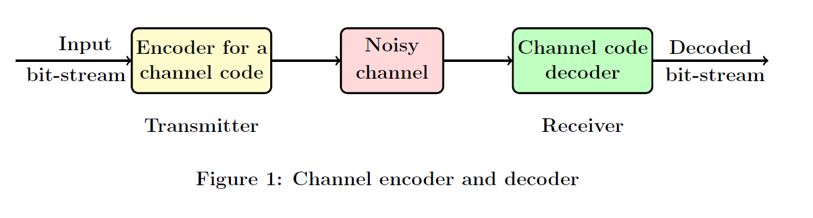
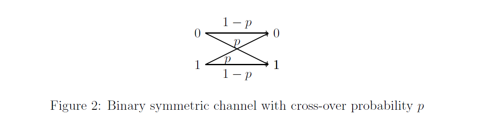
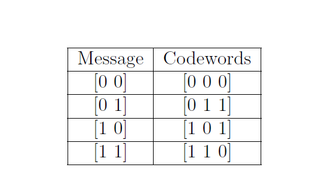

# 0. Preliminaries

## 0.1 Set theory:

A set is a collection of objects, either concrete or abstract. In the study of probability we are particularly interested in the set of all outcomes of a random experiment and subsets of their set.

### Definition 1 *(Union of sets)*:
_The Union of two sets $E \; \& \; F$ is the set of all elements that are in atleast one of the sets $E$ or $F$._

### Definition 2 *(Intersection of sets)*:
_The Intersection of two sets $E \; \& \; F$ is the set of all elements that are common to both sets $E$ and $F$._

### Definition 3 *(Compliment of a set)*:
_The Compliment of a set $E$ is the set of all elements that are not in $E$._

### Definition 4 *(Difference of two sets)*:
_The difference of two sets $E \; \& \; F$ is the set of all elements that are in $E$ but not in $F$. It is denoted by $E - F$ or $E \backslash F$._

### Definition 5 *(Exclusive-or of two sets)*: 
_The Exclusive-or of two sets $E \; \& \; F$ is the set of all elements that are either in $E$ or in $F$ but not in both. It is defined as_
$$
\begin{align*}
    E \oplus F = (E-F) \cup (F-E)
\end{align*}
$$

### Definition 6 *(DeMorgan's laws)*:
_For any two sets $E \; \& \; F$,_

- $(E \cup F)^{c} = E^{c} \cap F^{c}$

- $(E \cap F)^{c} = E^{c} \cup F^{c}$

### Definition 7 *(Partition of a set)*:
_Given any set $E$, an $n-$partition of a $E$ consists of a sequence of sets_ $E_i$, $i$ = 1, 2, 3, $\cdots$, n _such that_
$$
\begin{align*}
E_i \subset E , \; \bigcup_{i=1}^{n} E_i = E, \; \& \; E_i \cap E_j = \phi, \; \forall i \neq j
\end{align*}
$$ 

### Definition 8 *(Equality of sets)*:
_Two sets $E \; \& \; F$ are said to be equal if every element of in $E$ is in $F$ and vice versa._
$$
\begin{align*}
E = F \text{ if } E \subset F \; \& \; F \subset E
\end{align*}
$$ 

### Definition 9 *(Disjoint sets)*:
_Two sets $E \; \& \; F$ are said to be disjoint if $E \cap F = \phi$._

## Probability:

A mathematical theory of probability will incorporate those concepts of chance which are expressed and implicit in common rational understanding. Let $A$ be an event, and the chance of $A$ occuring is $p$. The occurrence or non occurence of $A$ depends upon a chain of circumstances involved. This chain is called an experiment of trial. The result of the experiment is called its outcome.

Any experiment involving randomness can be modelled as a probability space. The space comprises of
- $\Omega$: Set of possible outcomes of the experiment
- $\mathcal{F}$: Set of events
- $\mathbb{P}$: Probability measure

### Definition 1 *(Sample space)*:
The set of all possible outcomes of an experiment of an experiment is called the sample space. Denoted by $\Omega$.

**_example 1:_** In the scenario of a coin being tossed, $\Omega = \{ H, T\}$

**_example 2:_** In the scenario of a dice being rolled, $\Omega = \{ 1, 2, 3, 4, 5, 6\}$

An event can be defined as a subset of the appropriate sample space $\Omega$. If $\Omega = \{ H, T\}$, then an event $A$ cab be $\{H\}$ or $\{H\}^{c}$ or $\{H\} \cap \{T\}$ or else if   $\Omega = \{ 1, 2, 3, 4, 5, 6 \}$, then $A$ can be $\{2, 4, 6\}$ or $\{1, 2, 3\}$ or $\{2\}^{c}$. The compliment of a subset $A$ of  $\Omega$ is  denoted as $A^{c}$. Whenever $A \; \& \; B$ are events in which we are interested to pursure, then we can reasonable concern ourselves with the events $A \cap B$, $A \cup B$, amd $A^{c}$ respectively. Two events $A \; \& \; B$ are disjoint if their intersection is the empty set $\phi$. 

- $\phi$ is said to be the **impossible event**
- $\Omega$ is said to be the **certain event** since some member of $\Omega$ will ceetainly occur.

All the subsets of $\Omega$ need not be events. 

### Definition 2 _(Field)_:
The collection of events, as a subcollection $\mathcal{F}$ of the set of all subsets of $\Omega$, which satisfy the following properties
- If $A \; \& \; B \in \mathcal{F}$, then $A \cup B \in \mathcal{F} \; \& \; A \cap B \in \mathcal{F}$
- If $A \in \mathcal{F}$, then $A^{c} \in \mathcal{F}$
- $\phi \in \mathcal{F}$ 

is called as a Field. From the definition of a Field, if $A_i, A_2, \cdots, A_n \in \mathcal{F}$, then $\bigcup_{i=1}^{n}A_i \in \mathcal{F}$. $\mathcal{F}$ is closed under finite unions and finite intersections also.

When $\Omega$ is infinite, we define $\sigma$- field $\mathcal{F}$ as follows
- $\phi \in \mathcal{F}$
- If $A_1, A_2, \cdots \in \mathcal{F}$, then $\bigcup_{i=1}^{\infty}A_i \in \mathcal{F}$
- If $A \in \mathcal{F}$, then $A^{c} \in \mathcal{F}$

Every experiment is associated with a pair $(\Omega, \mathcal{F} )$. We call $A$  to be an event of the experiment if $A \in \mathcal{F}$

### Definition 3 _(Probability measure)_:
A probability measure $\mathbb{P}$ on $(\Omega, \mathcal{F} )$ is a function $\mathbb{P}: \mathcal{F} \to [0, 1]$ satisfying 
1. $\mathbb{P}(\phi) = 0$
2. $\mathbb{P}(\Omega) = 1$
3. If $A_1, A_2, \cdots$ is a collection of disjoint members of $\mathcal{F}$, in that $A_i \cap A_j = \phi$ for all pairs $i, j$ satisfying $i \neq j$ then  

$$\begin{align*}
\mathbb{P} ( \bigcup_{i = 1}^{\infty} A_i ) = \sum_{i = 1}^{\infty} \mathbb{P}(A_i)
\end{align*}
$$.

This triple $(\Omega, \mathcal{F}, \mathbb{P})$ is called as a probability space. A measure on the pair $(\Omega, \mathcal{F})$ is a function $\mu : \mathcal{F} \to [0, \infty)$ satisfying points $(1)$ and $(3)$ from the above definition. A measure $\mu$ is a probability measure if $\mu( \Omega ) =  1$.

**_example 3_:**
A coin, possibly biased, is tossed once. We can take $\Omega = \{H, T\}$ and $\mathcal{F} = \{\phi, \Omega, H, T\}$. A possible probability measure $ \mathbb{P} : \mathcal{F} \to [0, 1]$ is given by

- $\mathbb{P}(\phi) = 0$
- $\mathbb{P}(\Omega) = 1$
- $\mathbb{P}(H) = p$
- $\mathbb{P}(T) = 1-p$
where $p \in [0,1]$. If p = 0.5, then we can say that the coin is fair.

### Important properties of a typical probability space:
- $\mathbb{P}(A^{c}) = 1- \mathbb{P}(A)$
- If $B \subset A $, then $\mathbb{P}(B) = \mathbb{P}(A) + \mathbb{P}(B|A) \geq  \mathbb{P}(A)$
- $\mathbb{P}(A \cup B) =\mathbb{P}(A) + \mathbb{P}(B) - \mathbb{P}(A \cap B) $
- More generally, if $A_1, A_2, \cdots, A_n$ are events, then 

$$
\begin{align*}
    \mathbb{P}( \bigcup_{i=1}^{n}  A_i) = \sum_{i} \mathbb{P}(A_i) - \sum_{i<j}\mathbb{P}(A_i \cap A_j) + \sum_{i<j<k}\mathbb{P}(A_i \cap A_j \cap A_k) \cdots + (-1)^n+1 \mathbb{P}(A_1 \cap A_2 \cap A_3 \cdots \cap A_n) 
\end{align*}
$$, where, for example, $\sum_{i<j}$ sums over all unordered pairs $(i,j)$ with $i \neq j$.

An event $A$ is called null event if $\mathbb{P}(A) = 0$, and if $\mathbb{P}(A) = 1$, we say that the event A occurs almost surely. Null events should not be confused with the impossible event $\phi$. Impossible event is null, but null events need not be impossible.

### Conditional probability:
An experiment is repeated $N$ times, and on each occasion we observe the occurrences (or non occurrences) of two events $A$ and $B$. We observe that the probabilty that $A$ occurs given $B$ occurs should be reasonably defined as 
$$\begin{align*}
\frac{\mathbb{P}(A \cap B)}{\mathbb{P}(B)}
\end{align*}
$$ 

Probabilistic intuition also leads to the same conclusion. Given that event $B$ occurs, if it is the case that event $A$ occurs if and only $\mathbb{P}(A \cap B)$ occurs. The conditional probability of $A$ given $B$ should be proportional to $\mathbb{P}(A \cap B)$.
$$
\begin{align*}
    \text{$\mathbb{P}(A|B)  = \alpha \mathbb{P} (A \cap B)  $ for some const $\alpha$} \\
    \text{The conditional property of $\Omega$ given $B$ must be equal to $1$}\\
    \text{Thus $\alpha \mathbb{P} (\Omega \cap B) = 1  $ }\\
    \text{$\Rightarrow \alpha \mathbb{P} (B) = 1  $ }\\
    \text{ $\Rightarrow \alpha = \frac{1}{\mathbb{P} (B)} $}
\end{align*}
$$

### Definition 4 _(Conditional Probability)_
If $\mathbb{P}(B) > 0$, then the conditional probability that $A$ occurs given that $B$ occurs is defined as
$$
\begin{align*}
\mathbb{P}(A|B) = \frac{\mathbb{P}(A \cap B)}{\mathbb{P}(B)}
\end{align*}
$$

##### Independence
In general, the occurence of some event $B$ changes the probability that another event $A$ occurs. Where the original probability $\mathbb{P}(A)$ being replaced by $\mathbb{P}(A|B)$. If the original probability remains unchanged, then we say that the two events $A \; \& \; B$ are independent. 

$$
\begin{align*}
\mathbb{P}(A|B) =\mathbb{P}(A|B)
\end{align*}
$$

**Definition 5 (Independence)**
Events $A \; \& \; B$ are called independent events if $\mathbb{P}(A \cap B) =  \mathbb{P}(A) * \mathbb{P}(B)$. More generally, a family of events defined as $\{A_i : i \in I\}$ are independent if 
$$
\begin{align*}
\mathbb{P}(\bigcap_{i \in J}^{}) = \prod_{i \in J} \mathbb{P}(A_i)
\end{align*}
$$, for all finite subsets $J$ of $I$.

Common mistake: If $A \; \& \; B$ are independent, then we assume that $A \cap B = \phi$. This is the case when $A \; \& \; B$ are mutually independent not when $A \; \& \; B$ are independent.

If the family of events $\{A_i : i \in I\}$ has the property that $\mathbb{P}( A_i\cap A_j) = \mathbb{P}(A_i) * \mathbb{P}(A_j) \forall i \neq j$ then it is called pairwaise independent set of events. Let $C$ be an event with $\mathbb{P}(C) > 0$, then the two events $A \; \& \; B$ are called conditionally independent given $C$ if 

$$
\begin{align*}
\mathbb{P}(A \cap B|C) =\mathbb{P}(A|C) * \mathbb{P}(B|C)
\end{align*}
$$

##### Completeness
Let $(\Omega, \mathcal{F}, \mathbb{P})$ be a probability space. Any event $A$ which has zero probability, that is $\mathbb{P}(A) = 0$, is called a null event. It may seem reasonable that any subset $B \subset A$ will itself be null, but this may be without meaning since $B$ may not be an event, this $\mathbb{P}(B)$ may not be defined.

**Definition (Complete Space)**
A probability space $(\Omega, \mathcal{F}, \mathbb{P})$ is called a complete space if all subsets of null sets are events.

## Random Variables
Quantities governed by randomness correspond to functions on the probability space called *Random variables*. The values taken by a random variable is subject to chance, and the associated likelihoods are described by a function called the distributed function.

**Definition (Random variable)**
A random variable is a function $\mathcal(X): \Omega \to \mathbb{R}$ with the property that $\{ \omega \in \Omega: \mathcal(X) \leq x \} \in \mathcal{F} $ for each $x \in \mathbb{R}$. such a function is said to be   $\mathcal(F)$-measurable. Random variables map $\Omega$ into $\mathbb{R}$.

**example 1**
A fair coin is tossed twice. The sample space can be written as $\Omega = \{HH, HT, TH, TT\}$. For $\omega \in \Omega$, let $\mathcal{X}(\omega)$ be the number of heads seen after the coin has been tossed twice, so $\mathcal{X}(HH) = 2, \mathcal{X}(HT) = \mathcal{X}(TH) = 1, \mathcal{X}(TT) = 0 $.

**example 2**
Let $\mathcal{W}$ be a random variable based on the experiment where a person $A$ is gambling $B$ rs amount on the result of the experiment. He gambles cumalatively so that his fortunes double everytime a head appears and is annhilated when a tail appears, so $\mathcal{W}(HH) = 4B, \mathcal{W}(HT) = \mathcal{W}(TH) = \mathcal{W}(TT) = 0 $.

After the experiment is done and the outcome $\omega \in \Omega$ is known, a random variable $\mathcal{X}: \Omega \to \mathbb{R}$ takes some value.

**Definition (Probability distributive function)**
The distributive function of a random variable $\mathcal{X}$ is the function $F: \mathbb{R} \to [0, 1] $ given by $F(x) = \mathbb{P}(\mathcal{X} \leq x)$

- For the above example
$$\begin{equation}
  F_{\mathcal{X}}(x) =
    \begin{cases}
      0 & \text{$x < 0$}\\
      \frac{1}{4} & \text{$0 \leq x < 1$}\\
      \frac{3}{4} & \text{$ 1 \leq x < 2$}\\
      1 & \text{$x \geq 2$} 
    \end{cases}       
\end{equation} $$

$$\begin{equation}
  F_{\mathcal{W}}(\omega) =
    \begin{cases}
      0 & \text{$\omega < 0$}\\
      \frac{3}{4} & \text{$ 0 \leq \omega < 4$}\\
      1 & \text{$\omega \geq 4$} 
    \end{cases}       
\end{equation} $$

The distribution $F$ has the following properties
- $\lim_{x \to - \infty} F(x) = 0 $, $\lim_{x \to \infty} F(x) = 1$

- if $x < y$. then $F(x) \leq F(y)$

- $F$ is a right continous, that is $F(x + h) \to F(x)$ as $h \to 0$

$F$ is the distribution function of some random variables if and only if it satisfies the above 3 properties.

Suppose $F$ is a distributive function of $\mathcal{X}$. Then 
- $\mathbb{P}(\mathcal{X} > x) = 1 - F(x)$

- $\mathbb{P}(x < \mathcal{X} \leq y) = F(y) -F(x)$

- $\mathbb{P}(\mathcal{X} = x) = F(x) - \lim_(y \to x) F(y)$

Probability is a mathematical model to help us study physical systems in an average sense.

- $\Omega$ is used to denote two objects. It can be used to denote the set of all elementary outcomes of a random event and also the certain event.

## 1. Preliminaries

This section will introduce some preliminaries about finite fields,
binary arithmetic, and vector spaces that are relevant to Experiment-1.
For a detailed discussion of the topics, please refer [1, Ch. 2] and
[2, Ch. 1]. We shall discuss the following topics:

-   Introduction to finite fields and binary arithmetic.

-   Vector space spanned by the given set of vectors.

## 1.1 Introduction to finite fields and binary arithmetic

For all the experiments considered in this virtual lab, we consider
vectors and matrices that are defined over a finite field. In order to
define a finite field, we need to first define a "binary operation",
which is provided next.

**Definition 1** *(Binary operation): Let* $\mathbb{F}$ *be a set of elements. A binary  operation* $\star$ *is
a rule that assigns to each pair of  elements* $a, b \in \mathbb{F}$ *a uniquely defined third element* $c = a \star b \in \mathbb{F}$.

For example, consider the set of real numbers, denoted by $\mathbb{R}$. It can be verified that the addition operation defined for real numbers is a binary operation.  
 
In order to define a field, consider a set $\mathbb{F}$ on which two binary operations called addition $(+)$ and multiplication $(\cdot)$ are defined. For the given $\{\mathbb{F}, +, \cdot\}$,  
a definition of the field is given below.

**Definition 2** *(Field):*
$\{\mathbb{F}, +, \cdot\}$ *is said to be a field if satisfies the following axioms:*

-   *Associativity* of $(+)$ and $(\cdot)$: Elements
    $a, b, c \in \mathbb{F}$ satisfy $a + (b + c) = (a + b) + c$ and
    $a \cdot (b \cdot c) = (a \cdot b) \cdot c$.

-   *Commutativity* of $(+)$ and $(\cdot)$: Elements
    $a, b, c \in \mathbb{F}$ satisfy $a + b = b + a$ and
    $a \cdot b = b \cdot a$.

-   *Distributivity of multiplication over addition*: Elements
    $a, b, c \in \mathbb{F}$ satisfy
    $a \cdot (b + c) = (a \cdot b) + (a \cdot c)$.

-   *Additive identity*: There exist an element $0 \in \mathbb{F}$ such
    that $a + 0 = a$.

-   *Multiplicative identity*: There exist an element $1 \in \mathbb{F}$
    such that $a \cdot 1 = a$ and $1 \ne 0$.

-   *Additive inverses*: For every $a \in \mathbb{F}$, there exists an
    element in $\mathbb{F}$, denoted by $-a$, called the additive
    inverse of $a$, such that $a + (-a) = 0$.

-   *Multiplicative inverses*: For every $a \ne 0 \in \mathbb{F}$,
    there exists an element in $\mathbb{F}$, denoted by $a^{-1}$ or
    $1/a$, called the multiplicative inverse of $a$, such that
    $a \cdot a^{-1} = 1$.
    
It can be verified that the set of real numbers $\mathbb{R}$ along with the addition and multiplication defined over 
real numbers is a field. However the set of integers alongwith the addition and multiplication
defined over integers is not a field, since for integers multiplication
inverses are not integers.

Let us now consider an example of a field with finite number of
elements. Consider a set $\mathbb{F}_2$ =  \{ 0, 1 \}  with the addition
and multiplication operations for any $a, b \in \mathbb{F}_2$ defined as Equation (1)

$$
\begin{aligned}
0 + 0 = 0 \hspace{1in} 0 \cdot 0 &= 0\
0 + 1 = 1 \hspace{1in} 0 \cdot 1 &= 0\
1 + 0 = 1 \hspace{1in} 1 \cdot 0 &= 0 \hspace{1in} (1) \
1 + 1 = 0 \hspace{1in} 1 \cdot 1 &= 1. 
\end{aligned}       
 $$

It can be verified that the set $\mathbb{F}_2$ alongwith the addition and multiplication operations defined in Eq. (1)
is a field, since it satisfies the axioms of Definition 2. Such a field with finite number of elements is called as a *finite field*. For most
of the experiments in this virtual lab, we will focus on the binary field $\mathbb{F}_2 = {0,1}$. 
We shall study more about finite fields in Experiment-6.

Except for Experiments 6 and 7, we will consider vectors and matrices
defined over the binary field $\mathbb{F}_2$. Vectors are denoted by
boldface letters and the components of a vector are denoted by lower
case letters, e.g. the components of a vector
$\mathbf{v} \in \mathbb{F}_2^n$ are denoted by
$\mathbf{v} = \begin{pmatrix}v_1 & v_2 & \ldots & v_n \end{pmatrix}$, where
each $v_i \in \mathbb{F}_2$ for $i = 1, 2, \ldots, n$. Vectors can
either be considered as row vectors or columns vectors, depending on the
context. Matrices are denoted by upper-case letters, e.g. consider a
matrix M in $\mathbb{F}_2^{m \times n}$ with $m$ rows and $n$ columns.
The component of the matrix M corresponding to the $i^{th}$  row and $j^{th}$
column, for $1\leq i \leq m$ and $1\leq j \leq n$, is denoted by
$M_{ij}$.

We shall next define addition and multiplication operations for vectors
and matrices that are defined over $\mathbb{F}_2$:

-   *Addition of two vectors:* The addition of two vectors
    $\mathbf{v}, \mathbf{w} \in \mathbb{F}_2^n$ consists of addition of
    their respective components defined according to Eq. (1), i.e.,
    $$\begin{aligned}
    \mathbf{v} + \mathbf{w} = 
    
    \begin{bmatrix}
     
    v_1 \ v_2 \ \vdots  \ v_n  
     
    \end{bmatrix}
     
    +
    \begin{bmatrix}
     
    w_1 \ w_2 \ \vdots  \ w_n
     
    \end{bmatrix}
     
    =
     
    \begin{bmatrix}
     
    v_1 + w_1 \ v_2 +w_2 \ \vdots  \ v_n+w_n
     
    \end{bmatrix}.\end{aligned}$$
     
     
For example, $\begin{bmatrix} 1 & 0 & 1\end{bmatrix} + \begin{bmatrix} 0 & 0 & 1\end{bmatrix} = \begin{bmatrix} 1 & 0 & 0\end{bmatrix}$.

-   *Multiplication of a vector by a scalar:*
    For a vector $\mathbf{v} \in \mathbb{F}_2^n$ and a scalar $a \in \mathbb{F}_2$, $a \cdot \mathbf{v}$ is given by
    $$
    \begin{align*}
    a \cdot \mathbf{v} =  
    a \cdot
    \begin{bmatrix} 
    v_1 \ v_2  \ \vdots  \ v_n
    \end{bmatrix} 
    =  
    \begin{bmatrix}
    a \cdot v_1 \ a \cdot v_2 \ \vdots  \ a \cdot v_n    
    \end{bmatrix}, 
    \end{align*}$$
    where the operation $a \cdot v_i$ for $i = 1, 2, \ldots, n$ is performed according to Eq. (1).

-   *Multiplication of a vector and a matrix*: For a vector $\mathbf{v} \in  \mathbb{F}_2^n$ and a matrix $M \in \mathbb{F}_2^{n \times m}$, $\mathbf{v} \cdot M$ is given by

    $$
    \begin{align*} 
    \mathbf{v} \cdot M &= 
    \begin{bmatrix}v_1 & v_2& \ldots& v_n\end{bmatrix}
    \cdot \begin{bmatrix}
    M_{11} & M_{12} & \ldots& M_{1m} \
    M_{21} & M_{22} & \ldots& M_{2m} \
    \vdots \
    M_{n1} & M_{n2} & \ldots& M_{nm}
    \end{bmatrix} \
    &= \begin{bmatrix}
    v_1 \cdot M_{11} + v_2 \cdot M_{12} + \ldots + v_n \cdot M_{1m} \
    v_1 \cdot M_{21} + v_2 \cdot M_{22} + \ldots + v_n \cdot M_{2m} \
    \vdots \
    v_1 \cdot M_{n1} + v_2 \cdot M_{n2} + \ldots +  v_n \cdot M_{nm}
    \end{bmatrix},
    \end{align*}
    $$
    where note that each component wise addition and multiplication is performed according to Eq. (1). Consider the following example.

    $$
    \begin{align*} 
    \begin{bmatrix}1 & 0& 1\end{bmatrix}
    \cdot \begin{bmatrix}
    0 & 0 & 1& 1 \
    0 & 1 & 1& 0 \
    1 & 0 & 1& 1 
    \end{bmatrix} 

    &= \begin{bmatrix}
    1 & 0 & 0 & 0 
    \end{bmatrix}.
    \end{align*}
    $$

## 1.2 Vector space spanned by the given set of vectors

In this section, we shall provide preliminaries about  vector space spanned the given set of finite number of vectors, subspace of a vector space, linearly independent vectors, basis of a vector space, dimension of a vector space. Towards defining the vector space spanned by the given set of vectors, we first define linear combination of the given set of vectors and scalars.

**Definition 3** _(Linear combination): The linear combination of the given set of  vectors $\mathbf{v}_1 , \mathbf{v}_2, \ldots, \mathbf{v}_m \in \mathbb{F}_2^n$ and the corresponding set of scalars $a_1, a_2, \ldots, a_m \in \mathbb{F}_2$ is defined as a vector $\mathbf{v}$ obtained as_
$$
\begin{align*}  
\mathbf{v} = a_1\mathbf{v}_1 + a_2\mathbf{v}_2+ \ldots + a_m\mathbf{v}_m. 
\end{align*}
$$
For example, the linear combination of 
$\mathbf{v}_1 = \begin{bmatrix} 1 & 1 & 0\end{bmatrix}, \mathbf{v}_2 = \begin{bmatrix} 0 & 1 & 0\end{bmatrix}, \mathbf{v}_3 = \begin{bmatrix} 1 & 1 & 1\end{bmatrix} \in \mathbb{F}_2^3$ 
and the corresponding set of scalars $a_1=0, a_2 = 1, a_3 = 0 \in \mathbb{F}_2$ is equal to $\begin{bmatrix} 0 & 1 & 0\end{bmatrix}$. We shall next provide the
definition of a vector space spanned by the given set of vectors.

**Definition 4** _(Vector space spanned the given set of vectors):The vector space $V$ spanned by the vectors $\mathbf{v}_1 , \mathbf{v}_2, \ldots, \mathbf{v}_m \in \mathbb{F}_2^n$ is defined as_
$$\begin{align*} 
V =\Big\{ 
\mathbf{v} \in \mathbb{F}_2^n \Big| \mathbf{v} =  a_1\mathbf{v}_1 + a_2\mathbf{v}_2+ ... + a_m\mathbf{v}_m \hspace{0.1cm} \textit{for some scalars} \hspace{0.1cm}
a_1, a_2, ..., a_m \in \mathbb{F}_2
\Big\}.
\end{align*}$$
This vector space $V$ is also called as the span of the vectors $\mathbf{v}_1 , \mathbf{v}_2, \ldots, \mathbf{v}_m$, denoted by  $V = {span} \{\mathbf{v}_1 , \mathbf{v}_2, \ldots, \mathbf{v}_m\}$. 

Note that a vector space is essentially the set of all possible linear combinations of the given set of vectors. Let us consider some examples for vector spaces. 

- Example-1: It can be verified that $\mathbb{F}_2^4$ is a vector space spanned by the following set of vectors 
$$\begin{align*}  
\mathbf{F}_2^4 = 
\hspace{0.05in}{span} \{\mathbf{e}_1 , \mathbf{e}_2, \mathbf{e}_3, \mathbf{e}_4\} 
= \hspace{0.05in}{span}
\left\{
\begin{bmatrix} 1 \ 0 \ 0 \ 0 \end{bmatrix}, \begin{bmatrix} 0 \ 1 \ 0 \ 0 \end{bmatrix}, 
\begin{bmatrix} 0 \ 0 \ 1 \ 0\end{bmatrix}, 
\begin{bmatrix} 0 \ 0 \ 0 \ 1 \end{bmatrix} 
\right\}  \hspace{1.4cm} (2)
\end{align*}$$
- Example-2: For any integer $n$, it can be verified that $\mathbb{F}_2^n$ is a vector space.

- Example-3: The vector space spanned by the vectors $\mathbf{v}_1 = \begin{bmatrix} 1 & 0 & 1 \end{bmatrix}, \mathbf{v}_2 = \begin{bmatrix} 0 & 0 & 1 \end{bmatrix}$  and $\mathbf{v}_3 = \begin{bmatrix} 0 & 1 & 0 \end{bmatrix}$ is given by
$$\begin{align*}
V = \hspace{0.05in}{span} \{\mathbf{v}_1 , \mathbf{v}_2, \mathbf{v}_3\} = 
\left\{
\begin{bmatrix} 0 \ 0 \ 0 \end{bmatrix}, \begin{bmatrix} 1 \ 0 \ 0 \end{bmatrix}, 
\begin{bmatrix} 0 \ 1 \ 0 \end{bmatrix}, 
\begin{bmatrix} 0 \ 0 \ 1 \end{bmatrix}, 
\begin{bmatrix} 1 \ 0 \ 1 \end{bmatrix}, 
\begin{bmatrix} 1 \ 1 \ 0 \end{bmatrix}, 
\begin{bmatrix} 0 \ 1 \ 1 \end{bmatrix},
\begin{bmatrix} 1 \ 1 \ 1 \end{bmatrix}
\right\}  \hspace{0.3cm} (3)
\end{align*}$$
Note that $V = \mathbf{F}_2^3$ since it consists of all possible vectors in $\mathbf{F}_2^3$. 

- Example-4: Consider the vector space spanned by  
the vectors $\mathbf{v}_1$ and  $\mathbf{v}_2$ defined in Example-3. It is given by
$$\begin{align*}
W\hspace{0.3cm} = \hspace{0.3cm}{span}\{\mathbf{v}_1, \mathbf{v}_2\}
= \left\{
\begin{bmatrix} 0 \ 0 \ 0 \end{bmatrix}, 
\begin{bmatrix} 1 \ 0 \ 1 \end{bmatrix}, 
\begin{bmatrix} 0 \ 0 \ 1 \end{bmatrix}, 
\begin{bmatrix} 1 \ 0 \ 0 \end{bmatrix}
\right\} \hspace{3cm} (4)
\end{align*}$$

We shall next define a subspace of a vector space.

**Definition 5** _(Subspace): A subspace of a vector space is a nonempty subset that satisfies the requirements for a vector space._

For the examples (Example-3 and 4) mentioned above, $W=\hspace{0.001in}{span}\{\mathbf{v}_1, \mathbf{v}_2\}$ is a subspace of $V=\hspace{0.001in}{span}\{\mathbf{v}_1, \mathbf{v}_2, \mathbf{v}_3\}$.  

**Definition 6** _(Linear independence): A given set of vectors
$\mathbf{v}_1 , \mathbf{v}_2, \ldots, \mathbf{v}_m \in \mathbb{F}_2^n$ are said to be independent
if and only if $a_1\mathbf{v}_1 + a_2\mathbf{v}_2+ \ldots + a_m\mathbf{v}_m = \mathbf{0}$ can happen only when $a_1 = a_2 = \ldots = a_m = 0$._ 

For example, it can be verified that the vectors $\mathbf{v}_1 = \begin{bmatrix} 1 & 0 & 1 \end{bmatrix}, \mathbf{v}_2 = \begin{bmatrix} 0 & 0 & 1 \end{bmatrix}$  and $\mathbf{v}_3 = \begin{bmatrix} 0 & 1 & 0 \end{bmatrix}$ are linearly independent since $a_1\mathbf{v}_1 + a_2\mathbf{v}_2+ a_3\mathbf{v}_3$ gives an all-zero vector only when we choose $a_1=a_2=a_3=0$. 
Whereas the vectors $\mathbf{v}_1 = \begin{bmatrix} 1 & 0 & 1 \end{bmatrix}, \mathbf{v}_2 = \begin{bmatrix} 0 & 0 & 1 \end{bmatrix}$  and $\mathbf{v}_3 = \begin{bmatrix} 1 & 0 & 0 \end{bmatrix}$ are linearly dependent since $\mathbf{v}_1 + \mathbf{v}_2+ \mathbf{v}_3 = \mathbf{0}$.

Finally, we shall define _basis_ of a vector space and dimension of a vector space. 

**Definition 7** _(Basis of a vector space): A basis for a vector space $V$ is a set of vectors  having two properties at once:_

- The vectors are linearly independent
- They span the space $V$ 

For example consider the vector space $V = \mathbb{F}_2^3$. For this vector space, the set of vectors $\mathbf{v}_1, \mathbf{v}_2, \mathbf{v}_3$ given in Example-3 is a basis. However the set of vectors 
$\mathbf{w}_1 = \begin{bmatrix} 1 & 0 & 0 \end{bmatrix}$, $\mathbf{w}_2 = \begin{bmatrix} 1 & 0 & 1 \end{bmatrix}$, $\mathbf{w}_3 = \begin{bmatrix} 0 & 1 & 0 \end{bmatrix}$, $\mathbf{w}_4 = \begin{bmatrix} 1 & 1 & 1 \end{bmatrix}$
is not a basis for the vector space $\mathbb{F}_2^3$ since they are not linearly independent. Further, the set of vectors $\{\mathbf{w}_1, \mathbf{w}_2\}$ is not a basis for $\mathbb{F}_2^3$ since span $\{\mathbf{w}_1, \mathbf{w}_2\} \ne \mathbb{F}_2^3$. 

Note that a basis is not unique. The given vector space can have more that one basis. Can you find one more basis for the vector space $\mathbb{F}_2^3$ (Hint: See Eq (2))? Note that the number of vectors in any two bases will remain the same. This leads to the dimension of a vector space.  

**Definition 8** _(Dimension of a vector space): The dimension of a space is the number of vectors in every basis._

For example, the dimension of the vector space $\mathbb{F}_2^3$ is equal to $3$ since the set of vectors $\mathbf{v}_1, \mathbf{v}_2, \mathbf{v}_3$ given in Example-3 is a basis for $\mathbb{F}_2^3$. Dimension of the vector space $W$ defined in Example-4 is equal to $2$ since $\{\mathbf{v}_1, \mathbf{v}_2\}$ is a basis of the vector space $W$.

## 2. Linear block codes

Channel codes (or error correcting codes) are used in any digital communication system to provide a reliable communication over a noisy communication channel. Figure 1 shows a part of a digital communication system focusing on the channel encoder-decoder (refer [1, Ch. 1] for a detailed description of a digital communication system). Suppose the transmitter wants to send a bit-stream over a noisy communication channel. A communication channel may corrupt this bit-stream. 

To combat these errors introduced by the channel, a channel encoder is used at the transmitter. The channel encoder adds redundant bits to this input bit-stream that help the receiver to recover (decode) the corrupted bit-stream.  

In Part-2 of Experiment-1, we shall introduce binary block channel codes, referred to as block codes from now on. We shall provide the definition of block codes and then 
consider a subclass of block codes, linear block codes, that satisfy the linearity property. We shall introduce two simple yet important families of block codes, repetition (REP) and single parity check (SPC) codes. Through examples of REP and SPC codes, we shall demonstrate how channel codes can be used to combat the errors introduced the noisy communication channel. For a detailed discussion of the topics, please refer [1,3].  
In the remaining part, we shall discuss the following topics:

- Introduction to linear block codes

- Repetition (REP) codes

- Single parity check (SPC) codes

## 2.1 Introduction to linear block codes

Recall that $\mathbb{F}_2^n$ denotes the vector space of all $n$-tuples over the finite field $\mathbb{F}_2$. Basics of finite fields and vector spaces are provided in Section 1. 

For block codes, the input bit-stream is first divided into vectors of length $k$. Thus the input to a channel encoder is a sequence of vectors of length $k$, also termed as message sequence. Let $\mathbf{m} \in  \mathbb{F}_2^k$ denotes one such $k$-length message vector. 
To each message $\mathbf{m}$, a block encoder assigns a vector $\mathbf{v} \in  \mathbb{F}_2^n$ of length $n > k$, according to _some rule_. This vector $\mathbf{v}$ is termed as the _codeword_ corresponding to message $\mathbf{m}$. Suppose there are $M$ distinct messages. A definition of a block code is given below.  

**Definition 9** _(Block code $\mathcal{C}(n, M)$): Consider any map (rule) that assigns a codeword vector $\mathbf{v} \in  \mathbb{F}_2^n$ to the given message vector $\mathbf{m} \in  \mathbb{F}_2^k$, where $n > k$. Then the set of codewords corresponding to the given set of $M$ distinct messages is termed as a block code (or a codebook). The parameter $n$ is called as the length of the code._  
In general note that, the map associated with the a block code need not be one-to-one, i.e., the codewords corresponding to distinct messages need not be distinct. However for the purpose of this lab, we shall focus on the maps where there is a one-to-one correspondence between a message and codeword.

Let us consider an example for a block code. 
Let 
$\left \{\begin{bmatrix} 0 & 1\end{bmatrix}, \begin{bmatrix} 1 & 1\end{bmatrix} \right\}$ be the set of distinct messages that a transmitter wishes to transmit. Consider the map that assigns the vector $\begin{bmatrix} 0 & 1 & 1 & 1 \end{bmatrix}$ to the 
message $\begin{bmatrix} 0 & 1\end{bmatrix}$ and the vector $\begin{bmatrix} 1 & 1 & 0 & 1 \end{bmatrix}$ to the message $\begin{bmatrix} 1 & 1\end{bmatrix}$. Then the vectors $\begin{bmatrix} 0 & 1 & 1 & 1 \end{bmatrix}$ and $\begin{bmatrix} 1 & 1 & 0 & 1 \end{bmatrix}$ are termed as the codewords corresponding to the messages $\begin{bmatrix} 0 & 1\end{bmatrix}$ and $\begin{bmatrix} 1 & 1\end{bmatrix}$ respectively and $\mathcal{C}(4,2) = \left\{\begin{bmatrix} 0 & 1 & 1 & 1 \end{bmatrix},\begin{bmatrix} 1 & 1 & 0 & 1 \end{bmatrix} \right\}$ is the corresponding codebook or block code. 

Note that a binary vector $\mathbf{m} \in \mathbb{F}_2^k$ can take $2^k$ possible distinct values. For linear block codes, all possible $2^k$ vectors in $\mathbb{F}_2^k$ comprises the set of distinct messages. However, for linear block codes the map assigning messages to codeword cannot be arbitrary. For linear block codes, as the name suggests, this map should be linear, i.e., it should satisfy the property that addition of any two codewords should also be a codeword. A definition of a linear block code is given below.      

**Definition 10** _(Linear block code $\mathcal{C}(n,k)$): A block code of length $n$ and $2^k$ codewords is called as a linear block code if and only if its $2^k$ codewords form a $k$-dimensional subspace of the vector space $\mathbb{F}_2^n$. The parameters $n$ and $k$ are called as the length and dimension of a linear block code respectively._

Let us consider an example for a linear block code for $k=2$. For $k=2$, the set of messages will be $\left \{\begin{bmatrix} 0 & 0\end{bmatrix}, \begin{bmatrix} 0 & 1\end{bmatrix}, \begin{bmatrix} 1 & 0\end{bmatrix}, \begin{bmatrix} 1 & 1\end{bmatrix} \right\}$. Consider the map that assigns codewords $\left \{\begin{bmatrix} 0 & 0 & 0\end{bmatrix}, \begin{bmatrix} 0 & 1 & 1\end{bmatrix}, \begin{bmatrix} 1 & 0 & 1\end{bmatrix}, \begin{bmatrix} 1 & 1 & 0\end{bmatrix} \right\}$ to these messages respectively. It can be verified that that this map is a linear and the set of codewords form a $2$-dimensional subspace of $\mathbb{F}_2^3$.

We shall next define the Hamming weight of a vector $\mathbf{v} \in \mathbf{F}_2^n$ and the Hamming distance between any two vectors $\mathbf{v}_1$ and $\mathbf{v}_2$ in $\mathbb{F}_2^n$. These notions will be used to define the minimum distance of a block code. 

**Definition 11** _(Hamming weight of a vector): The Hamming weight of a vector $\mathbb{v} \in \mathbb{F}_2^n$ is defined as the number of non-zero components in it._ 

 
**Definition 12** _(Hamming distance $d_H(\mathbf{v}_1, \mathbf{v}_2)$ between vectors $\mathbf{v}_1$ and $\mathbf{v}_2$): The Hamming distance between vectors $\mathbf{v}_1$ and $\mathbf{v}_2$ in $\mathbb{F}_2^n$ is defined as the number of position these two vectors differ from each other._

For example, the Hamming weight of the vector $\mathbf{v} = \begin{bmatrix} 1 & 0 & 0 & 1 & 1 \end{bmatrix} \in \mathbb{F}_2^5$ is equal to $3$. For the vectors $\mathbf{v}_1 = \begin{bmatrix} 1 & 0 & 0 & 1 & 1 \end{bmatrix} \hspace{0.1cm}{and}\hspace{0.1cm} \mathbf{v}_2 = \begin{bmatrix} 1 & 0 & 0 & 0 & 0 \end{bmatrix}$, the Hamming distance $d_H(\mathbf{v}_1, \mathbf{v}_2) = 2$. We shall next define the minimum distance of a block code.

**Definition 13** _(Minimum distance $d_{min}$ of a block code $\mathcal{C}(n,M)$): The minimum distance $d_{min}$ of the given block code is defined as  the minimum Hamming distance between any two codewords of the code, i.e._,
$$\begin{align*}  
\hspace{1in}d_{min} \coloneqq \min \left\{ d_H(\mathbf{v}_1, \mathbf{v}_2) \hspace{0.1in}{ such \hspace{0.1in} that } \hspace{0.1in} \mathbf{v}_1, \mathbf{v}_2 \in \mathcal{C}(n,M) \right\}.
\hspace{1in} 
\end{align*}$$

For the linear blocks it can be proved that, the minimum distance is equal the minimum Hamming weight of a non-zero codeword. A linear block code of length $n$, dimension $k$, and minimum distance $d_{min}$ is denoted by $\mathcal{C}(n,k, d_{min})$. 

We shall next discuss two families of linear block codes; repetition and single parity check codes. 

## 2.2 Repetition codes

Repetition codes are one of the simplest yet important class of linear block codes. For repetition codes we have
$k=1$, i.e., a message can either be $0$ or $1$. For the repetition code of length $n$ (REP-$n$ code), as the name suggests, the message to be transmitted is repeated $n$ times. Thus the codewords corresponding to the messages $0$ and $1$ are $\begin{bmatrix} 0 & 0 & \ldots & 0 \end{bmatrix}$ and $\begin{bmatrix} 1 & 1 & \ldots & 1 \end{bmatrix}$ respectively. For example, the codewords of REP-$5$ are given by $\left\{ \begin{bmatrix} 0 & 0 & 0 & 0 & 0 \end{bmatrix}, \begin{bmatrix} 1 & 1 & 1 & 1 & 1 \end{bmatrix}\right\}$. Typically the length $n$ of the repetition code is chosen to be an odd integer since an odd length is suitable for majority logic decoding of repetition codes when the noise is introduced a 
binary symmetric channel of cross-over probability $p$, denoted by BSC($p$). A few preliminaries about the binary symmetric channel are summarized in Remark 1.

**Remark 1** _(Binary symmetric channel (BSC($p$))): 
In this remark, we shall describe how noise is modeled according to the binary symmetric channel.
As shown in Figure 2 for BSC($p$), a transmitted bit is flipped independently with probability $p$._

_Without loss of generality we assume that_ $p < 1/2$, _since when_ $p > 1/2$, _one can first flip the entire received bit sequence and use the decoding algorithms developed for the the case when_ $p < 1/2$. _For example, when a vector_ $\begin{bmatrix} 0 & 1 & 1\end{bmatrix}$ _is transmitted over BSC_$(p)$, _the probability of receiving the vector_ $\begin{bmatrix} 1 & 1 & 0\end{bmatrix}$ _is equal to_ $p^2(1-p)$ _since the first and the third bits are flipped, whereas the second bit is not flipped. Note that a transmitted vector can get flipped to any vector in_ $\mathbb{F}_2^n$.

We shall now describe majority logic decoding for repetition codes of odd lengths. First note that, a transmitted codeword can get flipped to any vector in $\mathbb{F}_2^n$ (see Remark 1). According to majority logic decoding, the received vector     $\mathbf{y} \in \mathbb{F}_2^n$ is decoded as $1$ if the number of $1$'s are in it are in majority, otherwise it is decoded as $0$. For example, for REP-$3$ code, when received vector is 
$\mathbf{y} = \begin{bmatrix} 1 & 1 & 0\end{bmatrix}$, the decoded message is $1$, since the bit is in majority in this $\mathbf{y}$.  

We shall next illustrate how repetition codes can help to correct some of the errors introduced by the BSC.
Suppose the codeword $\begin{bmatrix} 1 & 1 & 1\end{bmatrix}$ is transmitted and the received vector is such that at most one of the bit is flipped. Then 
according to majority logic decoding, the decoded codeword will be $\begin{bmatrix} 1 & 1 & 1\end{bmatrix}$ and   receiver is able to correct such errors. 
However, note that if more than two bits are flipped then the decoded codeword will be incorrect and receiver is not able to correct such error patterns. 
In the Experiment-3 we shall see that REP-$n$ code is able to correct all possible error patterns of weight less than or equal to $\lfloor \frac{n-1}{2}\rfloor$.

## 2.3 Single parity check codes

For the single parity check (SPC) codes of length $n$ we have $k=n-1$. The codeword corresponding to the message $\mathbf{m} = \begin{bmatrix} m_0 & m_1 & \ldots & m_{n-2}\end{bmatrix} \in \mathbf{F}_2^{n-1}$ is given by
$\mathbf{v} = \begin{bmatrix} m_0 & m_1 & \ldots & m_{n-2}& p\end{bmatrix}$, where $p = m_0 + m_1 + \ldots + m_{n-2}$. 
For example for $(3,2)$ SPC code, 
the messages and the corresponding codewords are given below:

Let us now illustrate how SPC codes can be used for detection of some of the error patterns.
If $\mathbf{v} = \begin{bmatrix}v_1 & v_2 & \ldots & v_n \end{bmatrix}$ is a codeword of $(n, n-1)$ SPC then it satisfies the parity check equation given below
$$\begin{align*}
v_1 + v_2 + \ldots + v_n = 0. \hspace{0.9cm} (5)
\end{align*}$$ 
The property of SPC codes given in Eq. (5) is used to for single bit error detection. 
Suppose the codeword $\mathbf{v} = \begin{bmatrix}v_1 & v_2 & \ldots & v_n \end{bmatrix}$ of $(n,n-1)$ SPC code is transmitted and the received vector is such that one of the bit is flipped. Then the received vector will not satisfy the parity check equation of 
Eq. (5). This will indicate that that an error has occurred. Note that this will not help to identity the location of the error. Eq. (5) will just help us to _detect_ whether one-bit is flipped or not.  

Note that Eq. (5) will not be useful if two bits are flipped, since the received vector will satisfy Eq. (5) when exactly two bits are flipped.

