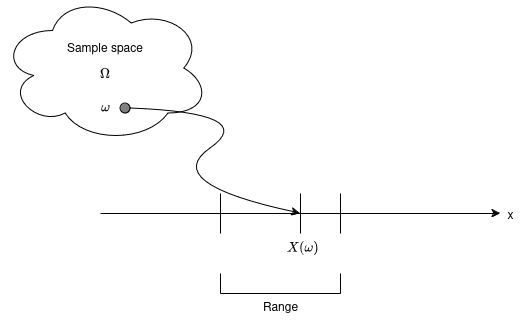
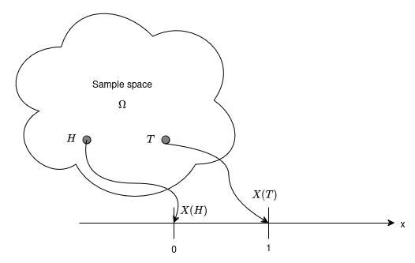
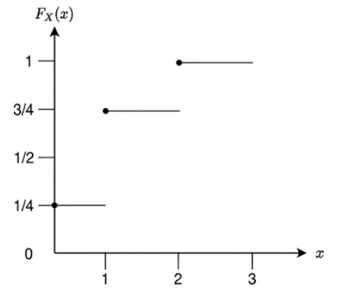
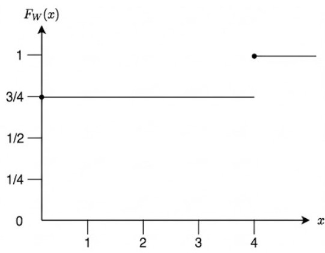

In a random experiment, the outcomes may not always be numerical and we maybe interested in some consequences of its random outcome. These outcomes maybe associated with some numerical values of interest using the notation of a random variable.

### Definition 1 _(Random variable)_ :

A random variable is a function $X : \Omega \to \mathbb{R}$ with the property that $\{ \omega \in \Omega : X(\omega) \leq x \} \in \mathcal{F} $ for each $x \in \mathbb{R}$. Random variables map $\Omega$ into $\mathbb{R}$.

  
   
  <strong>Figure 1:</strong> RV associated with a sample point

  
   
  <strong>Figure 2:</strong> RV associated with a coin toss exp

**_Example 1_**
A fair coin is tossed twice. The sample space can be written as $\Omega = \{HH, HT, TH, TT\}$. For $\omega \in \Omega$, let $\mathbb{X}(\omega)$ be the number of heads in $\omega$ so $\mathbb{X}(HH) = 2, \mathbb{X}(HT) = \mathbb{X}(TH) = 1, \mathbb{X}(TT) = 0 $. This function $X : \Omega \rightarrow \mathbb(R)$ is a random variable with respect to the $\sigma$ algebra $\mathcal{F} = \{ \phi, \Omega, \{ TT \}, \{ HH, HT, TH \}, \{ HH \}, \{ HT, TH, TT \} \} $,

**_Example 2_**
Let $\mathbb{W}$ be a random variable based on the experiment where a person $A$ is gambling $B$ rs amount on the result of the experiment. He gambles cumalatively so that his fortunes double everytime a head appears and is annhilated when a tail appears. Lets assume that the person $A$ has gambled twice. The sample space can be written as $\Omega = \{HH, HT, TH, TT\}$. For $\omega \in \Omega$ and the sigma algebra $\mathcal{F} = \{ \phi, \Omega, \{ TT, TH, HT \}, \{ HH \}\} $, so $\mathbb{W}(HH) = 4B, \mathbb{W}(HT) = \mathbb{W}(TH) = \mathbb{W}(TT) = 0 $.

After the experiment is done and the outcome $\omega \in \Omega$ is known, a random variable $\mathbb{X} : \Omega \to \mathbb{R}$ takes some value.

### Definition 2 _(Cumulative Distribution Function)_ :

The distribution function of a random variable $\mathbb{X}$ is the function $F_X : \mathbb{R} \to [0, 1] $ given by $F_X(x) = \mathbb{P}(\mathbb{X} \leq x)$

- For Example 1, if $P_X(x) = 1/4$, for all $x \in X$

$$
\begin{equation}
  F_{\mathbb{X}}(x) =
    \begin{cases}
      0 & \text{$x < 0$}\\
      \frac{1}{4} & \text{$0 \leq x < 1$}\\
      \frac{3}{4} & \text{$ 1 \leq x < 2$}\\
      1 & \text{$x \geq 2$} 
    \end{cases}   
\end{equation}
$$

  
   
  <strong>Figure 3:</strong> Distribution for Example 1

- For Example 2, if $P_W(\omega) = 1/4$, for all $\omega \in W$

$$
\begin{equation}
  F_{\mathbb{W}}(\omega) =
    \begin{cases}
      0 & \text{$\omega < 0$}\\
      \frac{3}{4} & \text{$ 0 \leq \omega < 4$}\\
      1 & \text{$\omega \geq 4$} 
    \end{cases}   
\end{equation}
$$

  
   
  <strong>Figure 4:</strong> Distribution Function for Example 2

The CDF $F$ has the following properties

- $\lim_{x \to - \infty} F(x) = 0 $, $\lim_{x \to \infty} F(x) = 1$
- if $x < y$. then $F(x) \leq F(y)$
- $F$ is a right continous, that is $F(x + h) \to F(x)$ as $h \to 0$

$F$ is the cumulative distribution function of some random variables if and only if it satisfies the above 3 properties.

Suppose $F$ is a CDF of $\mathbb{X}$. Then

- $\mathbb{P}(\mathbb{X} > x) = 1 - F(x)$
- $\mathbb{P}(x < \mathbb{X} \leq y) = F(y) -F(x)$
- $\mathbb{P}(\mathbb{X} = x) = F(x) - \lim_{(h \to 0^+)} F(x-h)$
